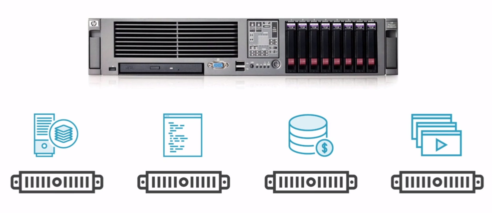
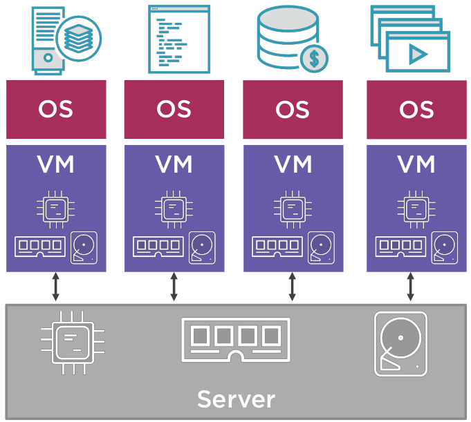
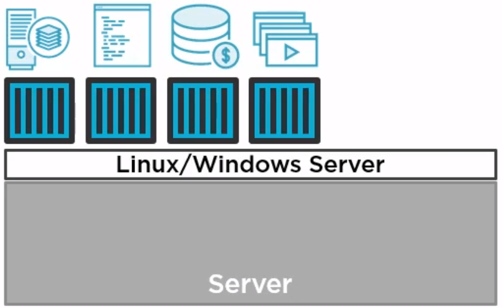

# Genomgång av Docker

```
 ____             _                
|  _ \  ___   ___| | _____ _ __  
| | | |/ _ \ / __| |/ / _ \ '__| 
| |_| | (_) | (__|   <  __/ |   
|____/ \___/ \___|_|\_\___|_|   

```
##### presenterad av Dominic Chan, dominic.chan@knowit.se

---

# Vad är Docker?

- Containrar är som snabba och lättviktiga virtuella maskiner.
- Docker gör det enkelt att bygga och köra våra applikationer i containrar.

---

# Bare metal



---

# Virtual Machines



---

# Containers



---

# VMs vs. Containers
&nbsp;&nbsp;&nbsp;&nbsp;&nbsp;&nbsp;&nbsp;&nbsp;&nbsp;&nbsp;&nbsp;&nbsp;&nbsp;&nbsp;&nbsp;&nbsp;


---

# Vad är en container runtime?
- Container runtime, även kallat container engine, är mjukvara som kan köra containrar på en dator.
- Docker (Dock + Worker)

---

# Det finns många container runtimes förutom Docker
- containerd
- CRI-O
- Docker Engine
- Mirantis Container Runtime
- m.m...

---

# Vad är funktionaliteten i en container runtime?
- ladda ned container image från repository
- kontrollera livscykel av container
- monitorera lokala systemresurser
- dela på/isolera systemresurser till container

---

# Installera Docker på Ubuntu 22.04
Följande länk på DigitalOcean visar hur Docker Engine installeras på Ubuntu [Länk](https://www.digitalocean.com/community/tutorials/how-to-install-and-use-docker-on-ubuntu-22-04).

`sudo apt install docker-ce`

---

# Bygg en Docker containerimage från Dockerfile

Kör kommandot `docker build -t docker-demo-app .`

Docker kommer att per default att leta efter Dockerfile. Om du vill specificera filen kör då kommandot `docker build -f Dockerfile -t docker-demo-app .`

---

# Kör igång Docker container

Använd kommandot `docker run -d -p 8080:80 docker-demo-app`

---

# Visa alla containrar som körs

Använd kommandot `docker ps -a`

---

# Gör ett testanrop till docker-demo-app containern

Använd kommandot `curl localhost:8080`

---

# Stoppa docker-demo-app containern

Använd kommandot `docker stop <container-id>`

---

# Rensa alla stoppade containrar

Använd kommandot `docker system prune` och svara `ja` för att bekräfta

---

# Ladda ned container image från Dockerhub

Använd kommandot `docker pull busybox`

---

# Visa alla container images som finns sparat lokalt

Använd kommandot `docker images`

---

# Ta bort container image som finns sparat lokalt

Använd kommandot `docker rmi <imageid>`

---

# Övningar:
1. Starta container imagen bkimminich/juice-shop som lyssnar på port 3000.
2. Testa att containern bkimminich/juice-shop körs.
3. Stoppa containern som du startade i steg 1.

---


# Frågor?


---

# Tack!


___