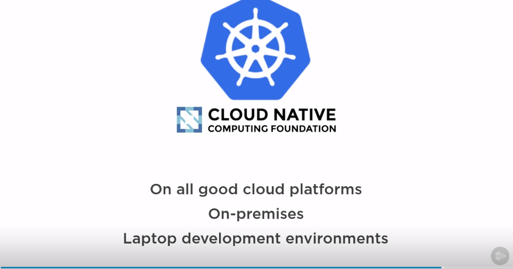
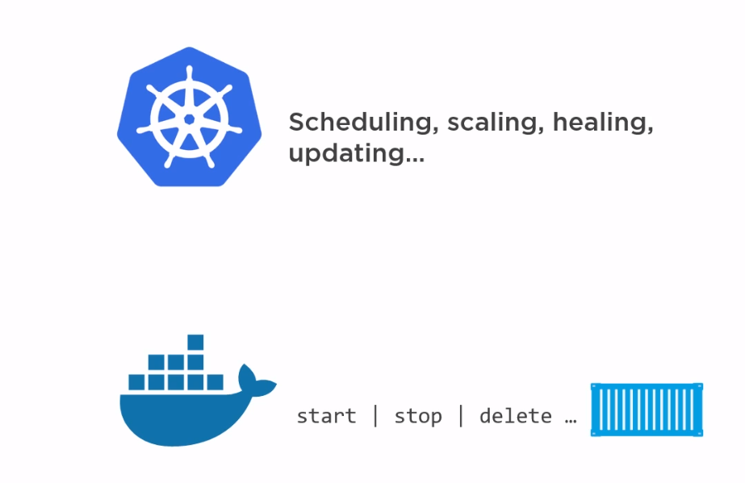
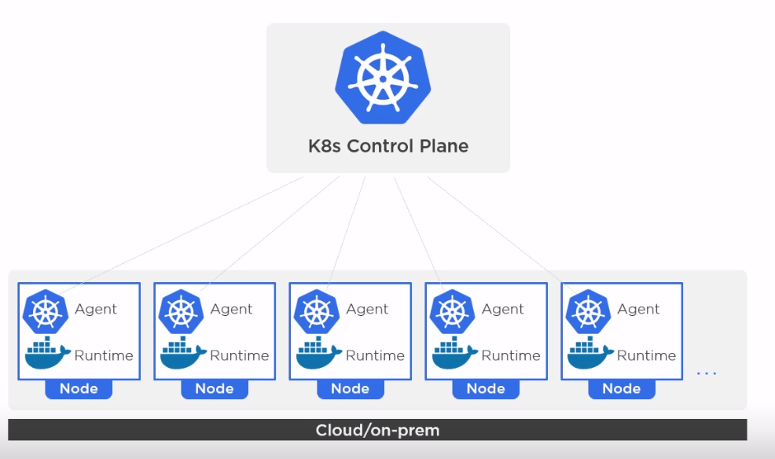
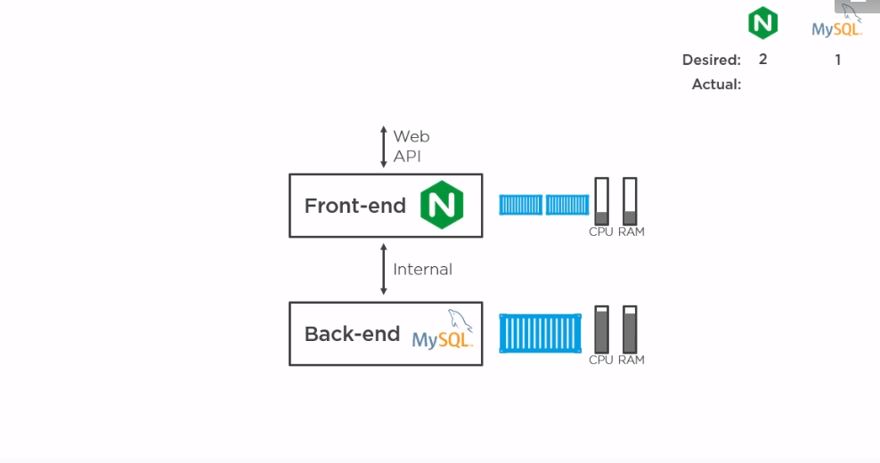
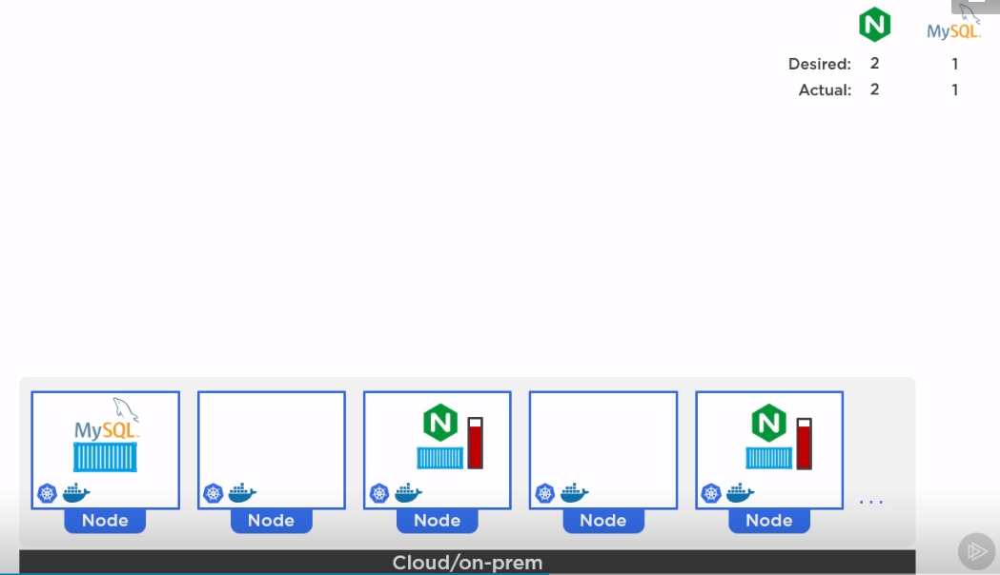
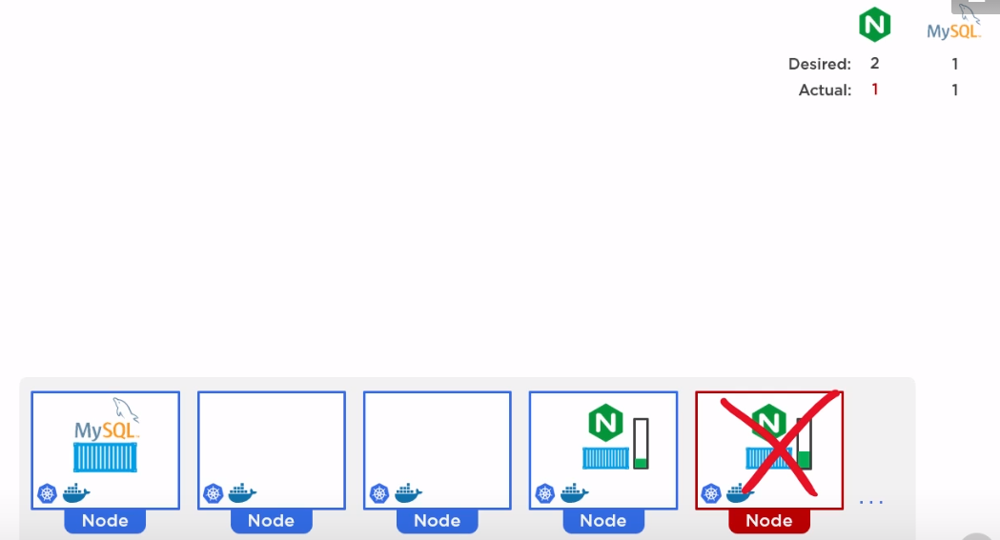
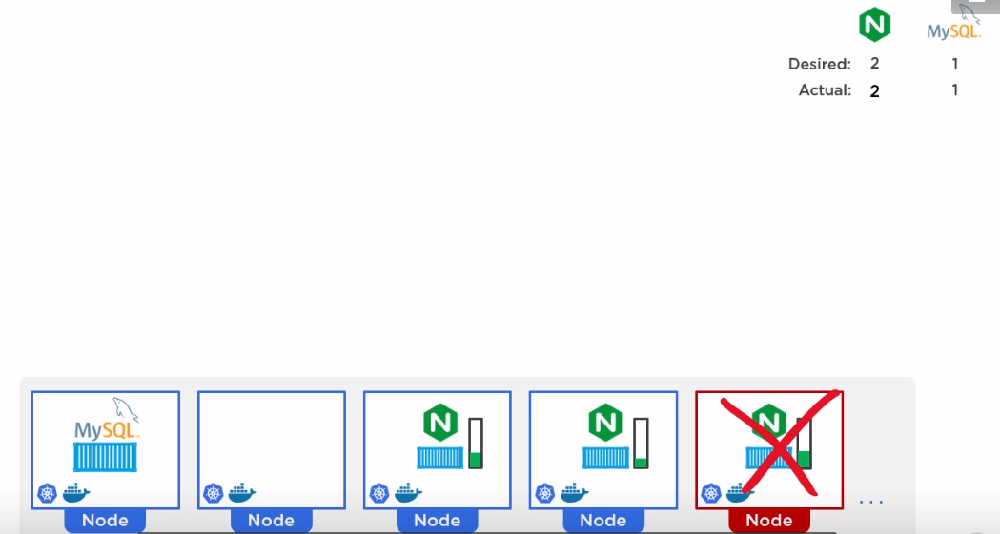
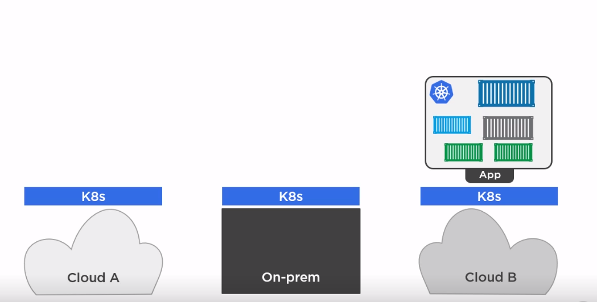

# En grundläggande kurs i Kubernetes

```
 _  __     _                          _            
| |/ /   _| |__   ___ _ __ _ __   ___| |_ ___  ___ 
| ' / | | | '_ \ / _ \ '__| '_ \ / _ \ __/ _ \/ __|
| . \ |_| | |_) |  __/ |  | | | |  __/ ||  __/\__ \
|_|\_\__,_|_.__/ \___|_|  |_| |_|\___|\__\___||___/


```
##### presenterad av Dominic Chan, dominic.chan@knowit.se

---

# Tillbakablick på 2. Docker

- Dockerfile används för att skapa och bygga container image
- Containerimage används för att skapa containerinstanser
- Containerimage lagras med hjälp av lager
- Det är lagertekniken som gör att containrar är såpass kompakta och effektiva

---

# Vad är Docker?

- Containrar är som snabba och lättviktiga virtuella maskiner.
- Docker gör det enkelt att bygga och köra våra applikationer i containrar.
- docker build| start | stop | delete | ps | system prune

---

# Vad är K8s

- Kubernetes (helmsman) "Rorsman" 
- Orkestrerar container via container runtime t.ex. Docker
- scheduling | scaling | healing | updating

---

# Google - containers


---

# Omega / Borg


---

# Cloud Native Opensource


---

# SSH till er AWS instans

`ssh -i ~/.ssh/aws-linux-demo.pem ubuntu@ubuntu@ec2-16-171-26-141.eu-north-1.compute.amazonaws.com`

---

# Installera Minikube

1. `cd knowit-kubernetes-kurs`
2. `cat minikube.sh`
3. `vim minikube.sh`
4. Tryck `:set nu` för att aktivera radnumrering.
5. Tryck i för att aktivera editeringsläge. Du kommer att se -- INSERT -- i vänstra nedre hörnet.
6. Ändra raden minikube start --insecure-registry "10.0.0.0/24" till minikube start --nodes 2 --insecure-registry "10.0.0.0/24"
7. Lägg till raden source .bashrc
8. Tryck på ESC för att komma ur editeringsläge. Tryck `:wq` för att spara och stänga vim.
9. `sudo chmod +x minikube.sh`
10. `./minikube.sh`

---

# Kubernetes vs Docker


---

# Control plane / Worker nodes


----

# Webbapplikation


----

# Kubernetes deployment


---

# Auto scaling


---

# Auto healing


---

# Auto healing


---

# Cloud ready


---

# Hands-on övningar som vi kommer att gå igenom
https://medium.com/bb-tutorials-and-thoughts/practice-enough-with-these-questions-for-the-ckad-exam-2f42d1228552

---

# Kubernetes dokumentation
- https://kubernetes.io/docs/home/
- https://kubernetes.io/blog/
- `kubectl explain <objekt>`
- `kubectl explain <objekt> --recursive`

---

# Kubernetes deklarativ manifest i YAML
- `kubectl get <objekt> -o yaml`
- `kubectl explain <objekt> --recursive`
    
--- 

# Grundläggande objekt och begrepp i Kubernetes
- Name space
- Nod
- Pod
- Deployment
- Service

---

# Lista alla namespaces

Använd kommandot `kubectl get ns`

---

# Lista alla nodes

Använd kommandot `kubectl get nodes`

---

# Lista alla pods

Använd kommandot `kubectl get pods`

`kubectl get pods -n kube-system`

---

# Kör en deploy med Nginx

Kör kommandot `kubectl create deployment nginx-deploy --image=nginx`

---

# Lista deployment

Använd kommandot `kubectl get deployment`

---

# Exponera deployment genom att skapa en service

Kör kommandot `kubectl expose deployment nginx-deploy --port=8080`
`kubectl get svc nginx-deploy`

---

# Ändra targetPort till 80 och type: NodePort

`kubectl edit svc nginx-deploy`
`i` för Insert mode
Ändra targetPort till 80. Ändra type: ClusterIP till type: NodePort.
`ESC` och sedan `:wq!` för att spara och gå ut

---

# Skapa en proxy till klustret

Använd kommandot `minikube service nginx-deploy`

---

# Testa göra anrop till den nya deployment

Kör kommandot `curl <http://proxy-ip:port>`

---

# Skala upp deployment

Använd kommandot `kubectl scale deployment nginx-deploy --replicas=10`

---

# Skala ned deployment

Använd kommandot `kubectl scale deploment nginx-deploy --replicas=5`

---

# Ta bort en eller flera podar

Kör kommandot `kubectl get pods`
Använd kommandot `kubectl delete po <podnamn>` för att ta bort en pod.
Kör kommandot `kubectl get pods` igen för att se vad som hänt med poden.
Kör kommandot `kubectl delete po --all`. Alla podar tas bort.
Kör kommandot `kubectl get pods`. Vad händer med podarna.

---

# Ta bort service och deployment

Använd kommandot `kubectl delete svc nginx-deploy`
`kubectl delete deployment nginx-deploy`
`kubectl get svc` och `kubectl get deployment`

---

# Övningar:
1. Skapa och kör en deployment som får heta apache-deployment med imagen "httpd".
2. Exponera den nya deployment på port 8080. Editera servicen så att den får targetPort 80. Ändra från type: ClusterIP till type: NodePort.
3. Skapa en proxy till klustret med kommandot `minikube service apache-deployment` 
4. Testa att göra anrop till proxyadressen.
5. Skala upp deployment till 5 replicas
6. Skala ned depolyment till 2 replicas
7. Ta bort de skapade servicen och deployment.

---

# Frågor?

---

# Tack!

---


