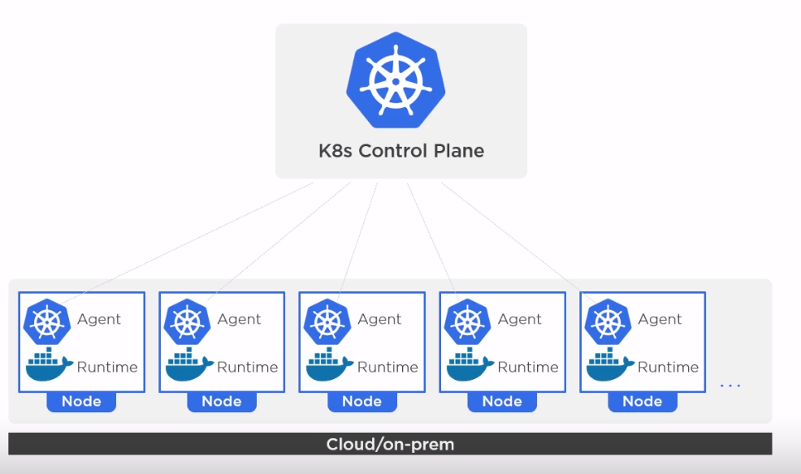
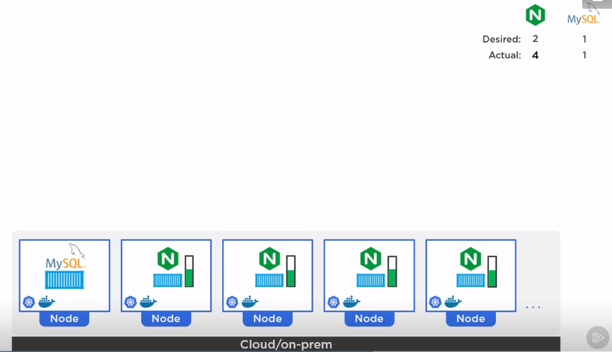
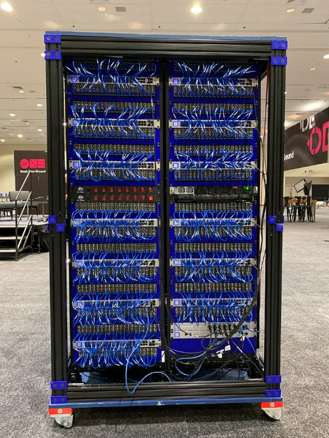
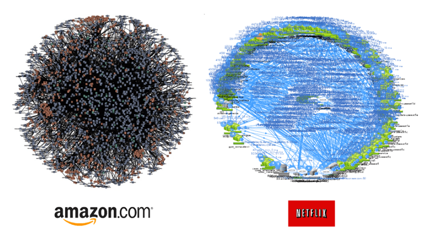
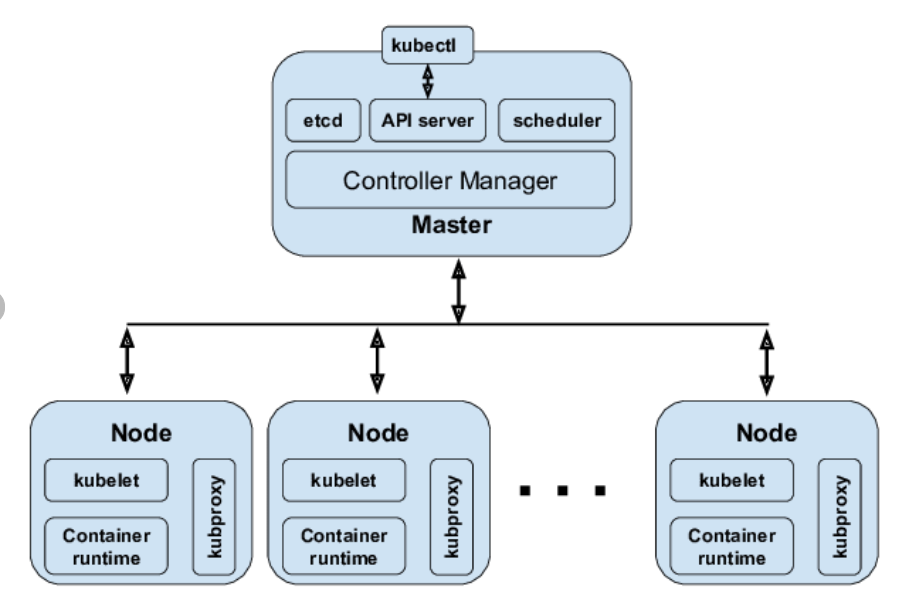
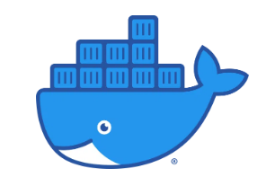

# En grundläggande kurs i Kubernetes

```
 _  __     _                          _            
| |/ /   _| |__   ___ _ __ _ __   ___| |_ ___  ___ 
| ' / | | | '_ \ / _ \ '__| '_ \ / _ \ __/ _ \/ __|
| . \ |_| | |_) |  __/ |  | | | |  __/ ||  __/\__ \
|_|\_\__,_|_.__/ \___|_|  |_| |_|\___|\__\___||___/


```
##### presenterad av Dominic Chan, dominic.chan@knowit.se

---

# Varför K8s?

- Orkestrering
- scheduling | scaling | healing | updating



---

# Webbapplikation


---

# Kluster 1060 raspberry pis


---

# Globalt nätverk av microtjänster


---

# Kubernetes under huven


https://kubernetes.io/docs/concepts/overview/components/

---


# SSH till er AWS instans

`ssh -i ~/.ssh/aws-linux-demo.pem ubuntu@ubuntu@ec2-16-171-26-141.eu-north-1.compute.amazonaws.com`

---

# Installera Minikube

1. `cd 4-kubernetes-grund-2`
2. `cat minikube.sh`
3. `sudo chmod +x minikube.sh`
4. `./minikube.sh`
5. minikube node add
6. Kör kommandot `source /home/ubuntu/.bashrc`

---

# Grundläggande objekt och begrepp i Kubernetes
- Name space
- Nod
- Pod
- Deployment
- Service

---

# Namespace
- Namespace i Kubernetes är ett verktyg för att organisera och isolera resurser på ett kluster och det används för att skapa separata arbetsmiljöer för olika applikationer eller projekt
- https://kubernetes.io/docs/concepts/overview/working-with-objects/namespaces/

---

# Nod
- En nod kan vara en fysisk eller virtuell dator som utgör en del utav klustret. 
- Den kan köra containrar och andra applikationsresurser. 
- En nod kan vara en control plane eller worker node.
- https://kubernetes.io/docs/concepts/architecture/nodes/

---

# Pod
- En nod kan ha flera containrar körandes på den
- Kubernetes hanterar containrarna i form av "pods". 
- En pod innehåller en eller flera containrar som delar sammar resurser som nätverk och lagringsutrymme. Tillsammans bildar de en pod som är den minsta hanterbara enheten i Kubernetes.
- https://kubernetes.io/docs/concepts/workloads/pods/

---

# Pods



---

# Deployment
- En deployment är en abstraktion som möjliggör att en eller flera instanser av en applikation kan köras och hanteras på ett robust och skalbart sätt på klustret.

---

# Service
- En service är en abstraktion som definierar en logisk grupp av poddar och tillhandahåller en stabil nätverksadress för att nå dem.
- Service möjliggör kommunikation mellan applikationer i klustret.
- Service möjliggör extern åtkomst till applikationer.

---

# Kubernetes dokumentation
- https://kubernetes.io/docs/home/
- https://kubernetes.io/blog/
- `kubectl explain <objekt>`
- `kubectl explain <objekt> --recursive`
- `kubectl get <objekt> -o yaml`

--- 

# Namespaces

Använd kommandon
- `kubectl get ns`
- `kubectl get ns -o yaml`
- `kubectl create ns test`
- `kubectl create ns prod`
- `kubectl create ns dev`

---

# Nodes

Använd kommandon
- `kubectl get nodes`
- `kubectl get node minikube`
- `kubectl get node minikube -o wide`
- `kubectl get node minikube -o yaml`
- `kubectl describe node minikube`

---

# Pods

Använd kommandon 
- `kubectl get pods`
- `kubectl get pods -n kube-system`
- `kubectl get pods -n kube-system -o wide`
- `kubectl get pod kube-controller-manager-minikube -o wide`
- `kubectl get pod kube-controller-manager-minikube -o yaml`
- `kubectl run nginx-test --image=nginx`


---

# Skapa/Kör en deployment med Nginx

Kör kommando
`kubectl create deployment nginx-deploy --image=nginx`

---

# Lista deployment

Använd kommando
`kubectl get deployment`

---

# Exponera deployment genom att skapa en service

Kör kommandon
- `kubectl expose deployment nginx-deploy --port=8080`
- `kubectl get svc nginx-deploy`

---

# Ändra targetPort till 80 och type: NodePort

`kubectl edit svc nginx-deploy`
`i` för Insert mode
Ändra targetPort till 80. Ändra type: ClusterIP till type: NodePort.
`ESC` och sedan `:wq!` för att spara och gå ut

---

# Skapa en proxy till klustret

Använd kommandot `minikube service nginx-deploy`

---

# Testa göra anrop till den nya deployment

Kör kommandot `curl <http://proxy-ip:port>`

---

# Skala upp deployment

Använd kommandot `kubectl scale deployment nginx-deploy --replicas=10`

---

# Skala ned deployment

Använd kommandot `kubectl scale deploment nginx-deploy --replicas=5`

---

# Ta bort en eller flera podar

- Kör kommandot `kubectl get pods`
- Använd kommandot `kubectl delete po <podnamn>` för att ta bort en pod.
- Kör kommandot `kubectl get pods` igen för att se vad som hänt med poden.
- Kör kommandot `kubectl delete po --all`. Alla podar tas bort.
- Kör kommandot `kubectl get pods`. Vad händer med podarna.

---

# Ta bort service och deployment

Använd kommandot `kubectl delete svc nginx-deploy`
`kubectl delete deployment nginx-deploy`
`kubectl get svc` och `kubectl get deployment`

---

# Övningar:
1. Skapa och kör en deployment som får heta apache-deployment med imagen "httpd".
2. Exponera den nya deployment på port 8080. Editera servicen så att den får targetPort 80. Ändra från type: ClusterIP till type: NodePort.
3. Skapa en proxy till klustret med kommandot `minikube service apache-deployment` 
4. Testa att göra anrop till proxyadressen.
5. Skala upp deployment till 5 replicas
6. Skala ned depolyment till 2 replicas
7. Ta bort de skapade servicen och deployment.

---

# Frågor?

---

# Tack!

---


