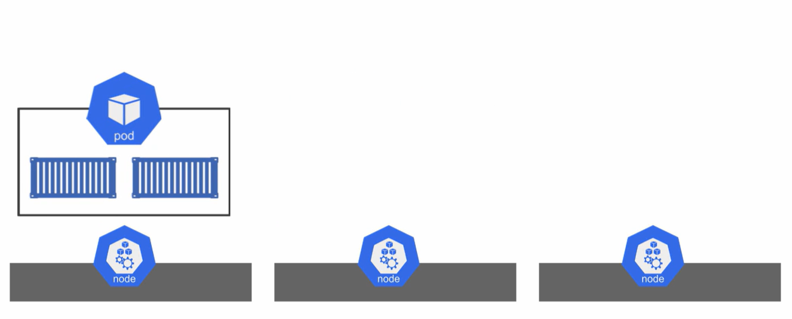
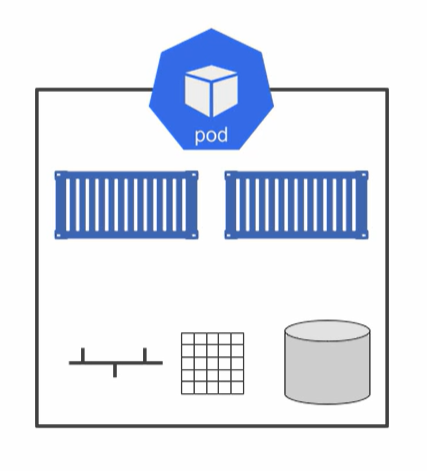
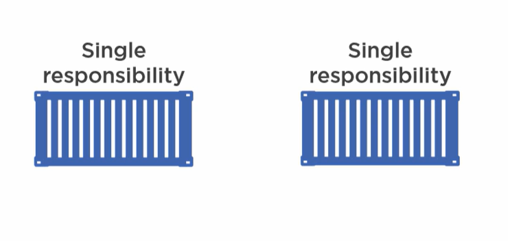
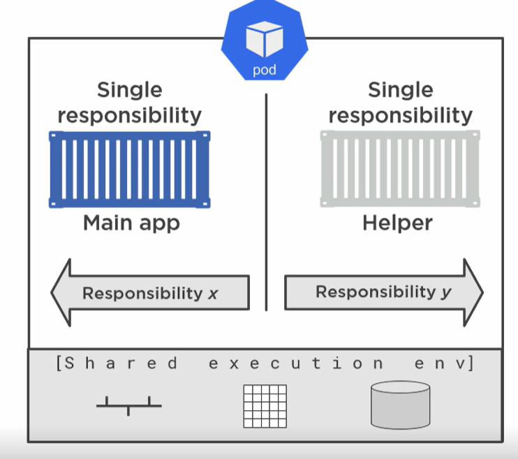
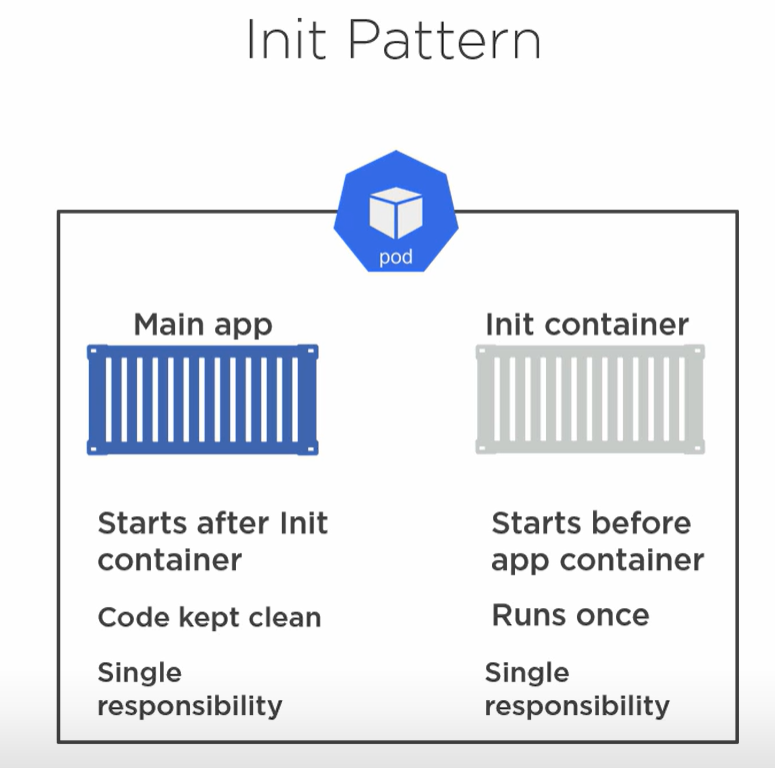
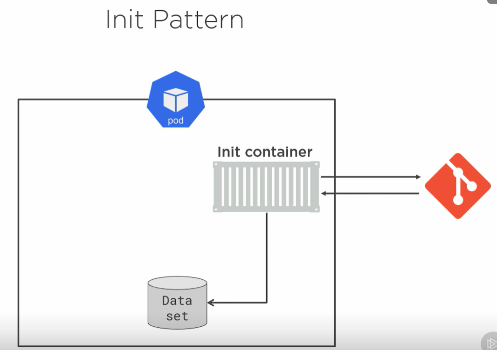
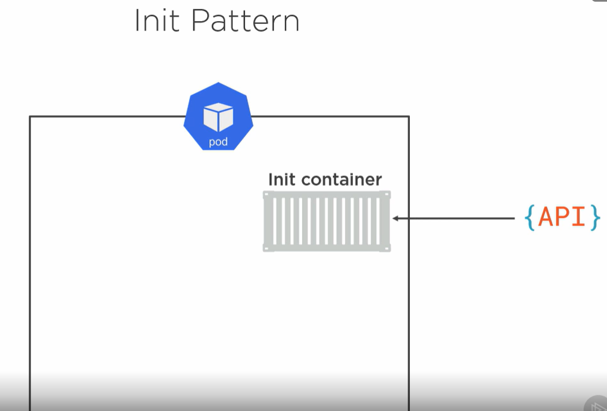

# 5. Multicontainer pods

```
 _  __     _                          _            
| |/ /   _| |__   ___ _ __ _ __   ___| |_ ___  ___ 
| ' / | | | '_ \ / _ \ '__| '_ \ / _ \ __/ _ \/ __|
| . \ |_| | |_) |  __/ |  | | | |  __/ ||  __/\__ \
|_|\_\__,_|_.__/ \___|_|  |_| |_|\___|\__\___||___/


```
##### presenterad av Dominic Chan, dominic.chan@knowit.se

---

# Pod
- En applikation paketeras till en container
- Kubernetes kan inte köra en enskild container
- En pod är den minsta enheten i Kubernetes
- En pod kan bestå av en container eller flera containrar

---

# Varför pod?

Kubernetes lägger till en rad med funktionalitet till pods t.ex.
- Probes
- Affinities
- Policyn för omstart
- Regler för terminering

---

# Pod
- Containrar i en pod hamnar alltid på samma nod


---

# Pod
- Containrar i en pod delar på samma nätverks-, minnes- och lagringsresurser


---

# Single responsibility
- Designprincip för mikrotjänster är att varje container har ett ansvarsområde
- Single responsibility = fokus på en process eller ett jobb


---

# Main-Helper
- Oftast behöver huvudapplikationen lite hjälp
- Bibehållen fördelning av ansvarsområde
- Uppmuntrar återanvändning


---

# Multicontainer patterns
- Init pattern
- Sidecar pattern
- Adapter pattern
- Ambassador pattern

---

# Init pattern
- Används för att förbereda en miljö för huvudapplikationen
- Startar och stängs ned innan huvudcontainern körs
- Körs enbart en gång


---

# Init pattern - Git repo
- Hämta från Git repo
  

---

# Init pattern - API tillgänglighet
- Invänta tillgänglighet på API
  

---
# Sidecar pattern
- Init container
- Sidecar container

---

# Adapter pattern
- Init container
- Sidecar container

---

# Ambassador pattern
- Init container
- Sidecar container

---

# SSH till er AWS instans

`ssh -i ~/.ssh/aws-linux-demo.pem ubuntu@ubuntu@ec2-16-171-26-141.eu-north-1.compute.amazonaws.com`

---

# Installera Minikube

1. `cd 4-kubernetes-grund-2`
2. `cat minikube.sh`
3. `sudo chmod +x minikube.sh`
4. `./minikube.sh`
5. minikube node add
6. Kör kommandot `source /home/ubuntu/.bashrc`

---

# Imperativ metod för att skapa pod
1. `kubectl run test-pod-1 --image=nginx`
2. `kubectl get pods`

---

# Deklarativ metod för att skapa pod
1. `kubectl run test-pod-2 --image=nginx --dry-run=client -o yaml`
2. `kubectl get pods`
3. `kubectl run test-pod-2 --image=nginx --dry-run=client -o yaml > test-pod-2.yaml`
4. `cat test-pod-2.yaml`
5. `kubectl apply -f test-pod-2.yaml`

---

# Skapa en pod och använd init container pattern
1. `kubectl run test-init-pod --image=nginx --dry-run=client -o yaml > test-init-pod.yaml`
2. `vim test-init-pod.yaml`

---

# Tack!

---


