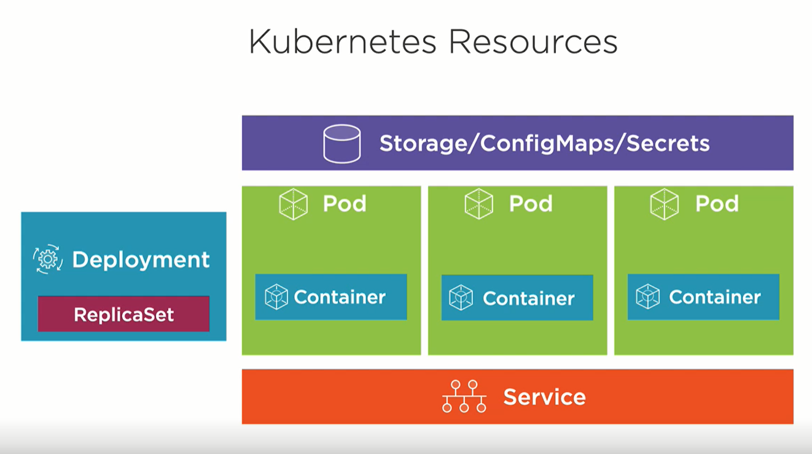

# 6. Pod Design

```
 _  __     _                          _            
| |/ /   _| |__   ___ _ __ _ __   ___| |_ ___  ___ 
| ' / | | | '_ \ / _ \ '__| '_ \ / _ \ __/ _ \/ __|
| . \ |_| | |_) |  __/ |  | | | |  __/ ||  __/\__ \
|_|\_\__,_|_.__/ \___|_|  |_| |_|\___|\__\___||___/


```

##### presenterad av Dominic Chan, dominic.chan@knowit.se

---

# SSH till er AWS instans

`ssh -i ~/.ssh/aws-linux-demo.pem ubuntu@ubuntu@ec2-16-171-26-141.eu-north-1.compute.amazonaws.com`

---

# Installera Minikube

1. `cd 6-pod-design`
2. `cat minikube.sh`
3. `sudo chmod +x minikube.sh`
4. `./minikube.sh`
5. minikube node add
6. Kör kommandot `source /home/ubuntu/.bashrc`

---

# Starta pods för genomgången

1. Kör kommandot `kubectl apply -f pods-labels-prepped.yaml`

---

# Labels, selectors

- Labels är key-value par som kan kopplas till Kubernetes objekt som t.ex. pods, nodes, services m.m.
- Labels används som beskrivande attribut till objekten för att man skall kunna organisera och filtrera dem.
- Label selector används för att gruppera, filtrera och sortera Kubernetes objekt
- https://kubernetes.io/docs/concepts/overview/working-with-objects/labels/

---

# Labels, selector - Exempel vid get/lista objekt

1. `kubectl get pods --show-labels`
2. `kubectl run nginx-prod3 --image=nginx -l env=prod`
3. `kubectl run nginx-prod4 --image=nginx --labels=env=prod`
4. `kubectl get pods --show-labels`
5. `kubectl get pods -l env=dev`
6. `kubectl get pods -l env=prod`
7. `kubectl get pods -L env`
8. `kubectl delete pods -l env=prod`

---

# Labels, selectors - Exempel vid schemaläggning av pod till specifik nod

1. `kubectl get nodes --show-labels`
2. `kubectl label node minikube-m02 disk=ssd`
3. `kubectl get nodes -L disk`
4. `kubectl run pod-select-node-ssd --image=nginx --dry-run=client -o yaml > pod-select-node-ssd.yaml`
5. `vim pod-select-node-ssd.yaml`
6. https://kubernetes.io/docs/tasks/configure-pod-container/assign-pods-nodes/
7. `kubectl apply -f pod-select-node-ssd.yaml`
8. `kubectl get pods -o wide`

---

# Annotations

- Annotations används för att lägga till beskrivningar till Kubernetes objekt som inte är till för att organisera eller
  filtrering.
- Annotations består av key-value par.
- Vissa tredje-part program använder annotations för att lägga till kopplingar till tredje-part program och plugins.
- https://kubernetes.io/docs/concepts/overview/working-with-objects/annotations/

---

# Annotations - Exempel annotera pod

- `kubectl annotate po pod-select-node-ssd disk=ssd`
- `kubectl get pod pod-select-node-ssd -o yaml`
- `kubectl describe pod pod-select-node-ssd`

---

# Deployment och replicaset

- En deployment är ett Kubernetes objekt och abstraktion som ger en möjlighet till deklarativ uppdateringar av
  ReplicaSets och Pods
- https://kubernetes.io/docs/concepts/workloads/controllers/deployment/

---

# Deployment och replicaset

- Deployment i förhållande till ReplicaSet, Pods och Service
  

---

# Skapa deployment imperativt

1. `kubectl create deployment nginx-deployment --image=nginx:1.23 --replicas=10 --port=80`
2. `kubectl get deployments`
3. `kubectl delete deployment nginx-deployment`

---

# Skapa deployment deklarativt

1. `kubectl create deployment nginx-deployment --image=nginx:1.23 --replicas=10 --port=80 --dry-run=client -o yaml > deployment-rollout.yaml`
2. `vim deployment-rollout.yaml`
3. `kubectl explain deployment.spec.strategy`
4. `kubectl apply -f deployment-rollout.yaml`
5. `kubectl get deployment`
6. `kubectl get pods`
7. `kubectl expose deployment nginx-deployment --type=NodePort`
8. `kubectl get svc -o wide`, leta fram portnumret (börjar med siffran 3)
9. `kubectl get nodes -o wide`, leta fram ip-nummer till en av noderna
10. `curl <ip-nummer-till-nod>:<portnummer>`

---

# Rolling update, rollback

1. `kubectl rollout status deployment/nginx-deployment`
2. `kubectl rollout history deployment/nginx-deployment`
3. `kubectl annotate deployment nginx-deployment kubernetes.io/change-cause=nginx:1.23`
4. `kubectl rollout history deployment/nginx-deployment`
5. `vim deployment-rollout.yaml`, byt ut imagen till nginx:1.24.
6. `kubectl apply -f deployment-rollout.yaml`
7. `watch -n 1 kubectl get pods`
8. `kubectl annotate deployment nginx-deployment kubernetes.io/change-cause=nginx:1.24`
9. `kubectl rollout history deployment/nginx-deployment`
10. `kubectl rollout undo deployment/nginx-deployment`
11. `kubectl rollout history deployment/nginx-deployment`

---

# Rollout pause och resume

1. `kubectl rollout pause deployment/nginx-deployment`
2. `vim deployment-rollout.yaml`, lägg märke till att imagen är nginx:1.24
3. `kubectl apply -f deployment-rollout.yaml`
4. `kubectl get pods`
5. `kubectl describe po <en-av-pod-namnen>`, lägg märke till att imagen fortfarande är kvar på nginx:1.23
6. `kubectl rollout resume deployment/nginx-deployment`
7. `watch -n 1 kubectl get pods`
8. `kubectl describe po <en-av-pod-namnen>`, lägg märke till att imagen är nginx:1.24

---

# Olika deploymentstrategier

- Canary deployment
- Blue and green deployment

---

# Övningar

- https://medium.com/bb-tutorials-and-thoughts/practice-enough-with-these-questions-for-the-ckad-exam-2f42d1228552 från
  övning 36 till 79.

---