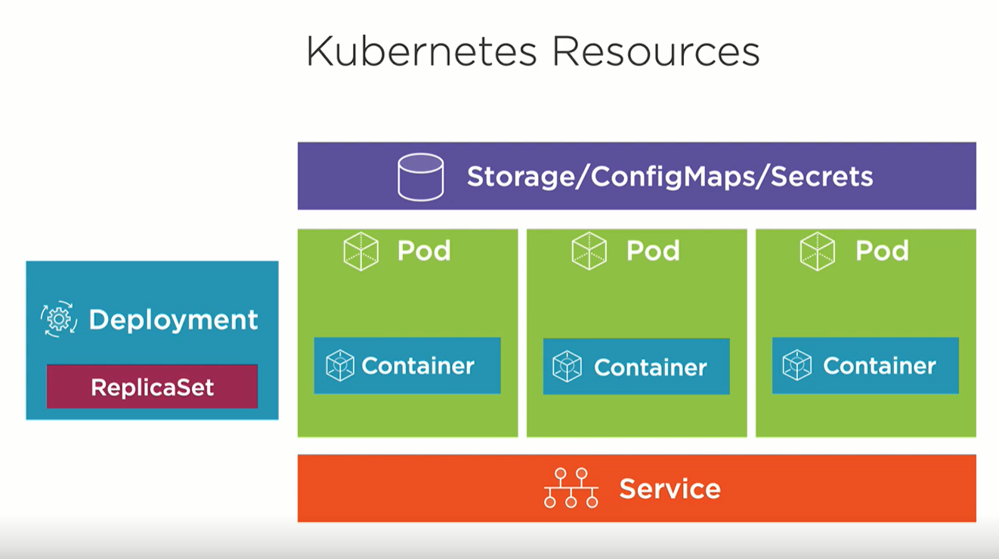
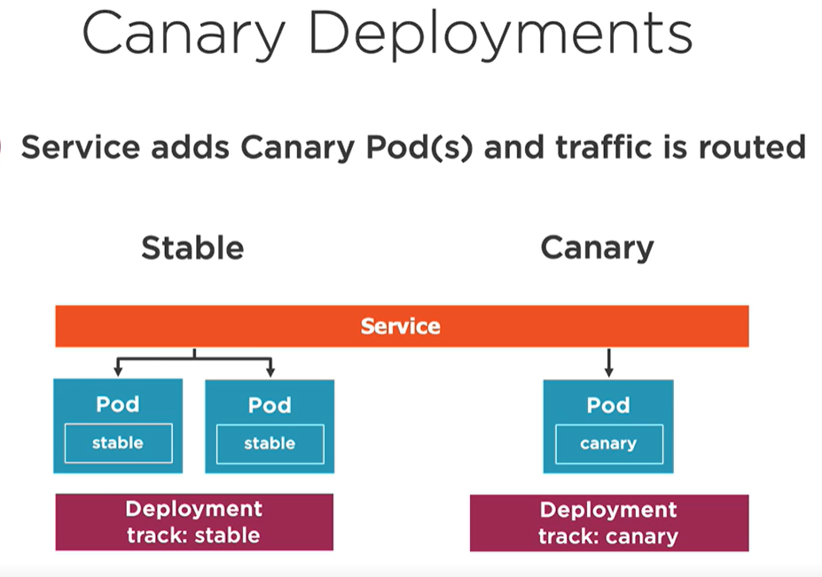
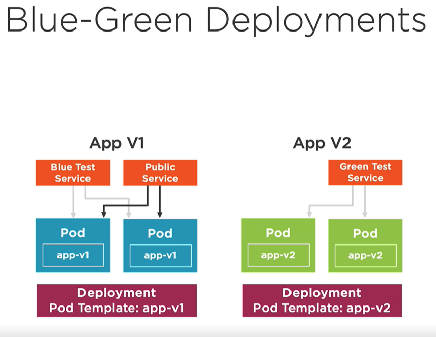
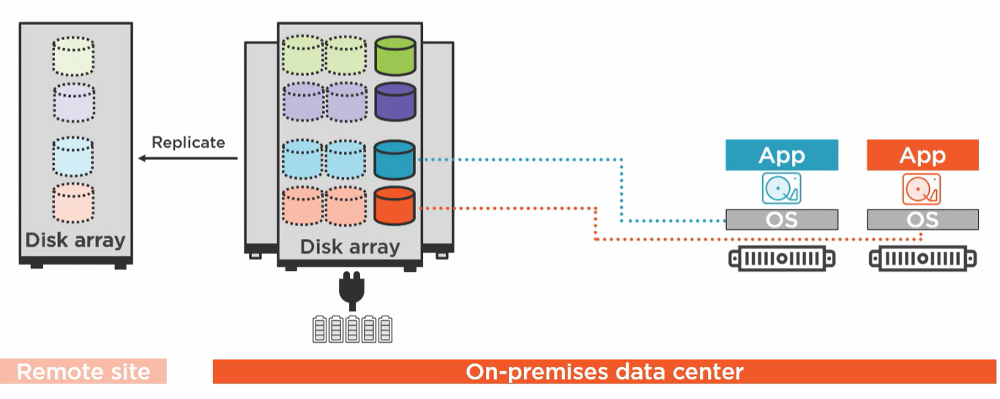
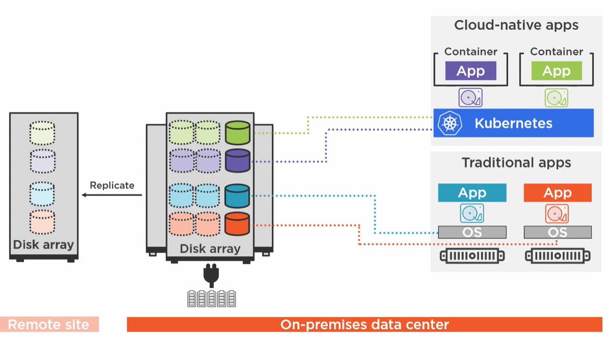
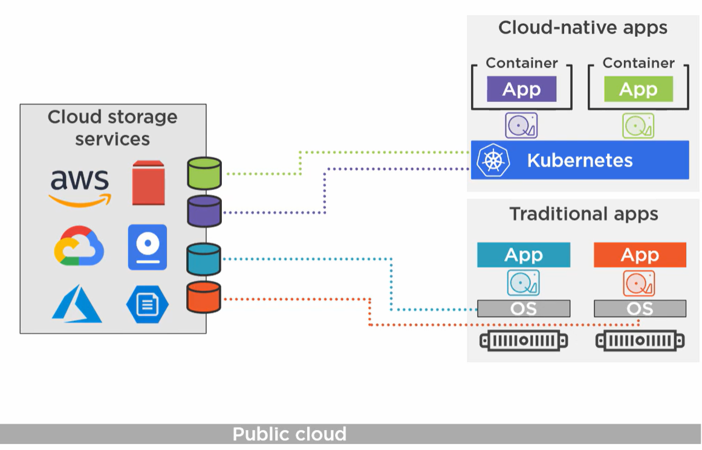
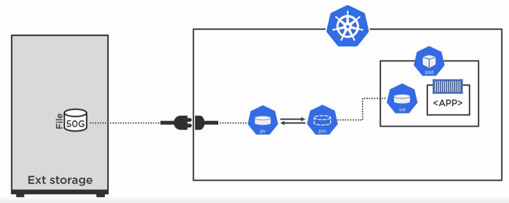
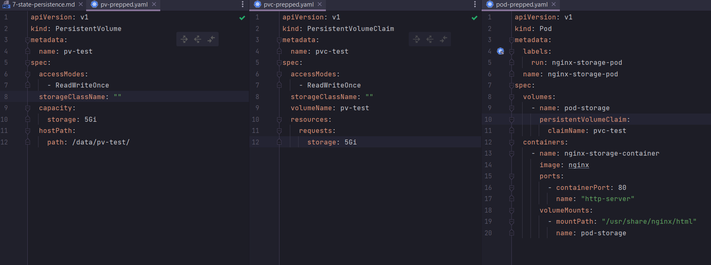

# 7. State persistence

```
 _  __     _                          _            
| |/ /   _| |__   ___ _ __ _ __   ___| |_ ___  ___ 
| ' / | | | '_ \ / _ \ '__| '_ \ / _ \ __/ _ \/ __|
| . \ |_| | |_) |  __/ |  | | | |  __/ ||  __/\__ \
|_|\_\__,_|_.__/ \___|_|  |_| |_|\___|\__\___||___/


```

##### presenterad av Dominic Chan, dominic.chan@knowit.se

---

# SSH till er AWS instans

`ssh -i ~/.ssh/aws-linux-demo.pem ubuntu@ubuntu@ec2-16-171-26-141.eu-north-1.compute.amazonaws.com`

---

# Installera Minikube

1. `cd 7-state-persistence`
2. `cat minikube.sh`
3. `sudo chmod +x minikube.sh`
4. `./minikube.sh`
5. Kör kommandot `source /home/ubuntu/.bashrc`

---

# Deployment och replicaset

- Deployment i förhållande till ReplicaSet, Pods och Service
  

---

# Starta deployment för genomgången

1. Kör kommandot `kubectl apply -f deployment-rollout-prepped.yaml`
   Detta skapar både deployment och service.
2. `kubectl get deployment`
3. `kubectl get svc`, anteckna nodePort (porten som startar med siffran 3)
5. `kubectl get nodes -o wide`
6. `curl <node-ip>:<node-port>`
7. `siege <node-ip>:<node-port> -d 1 -c 1 -t 1H`
8. `tmux`, Ctrl + b, %
9. Ctrl + b, piltangent <- eller ->

---

# Rollout pause och resume

1. `kubectl rollout pause deployment/nginx-deployment`
2. `vim deployment-rollout.yaml`, ändra tillbaka nginx version till 1.23
3. `kubectl apply -f deployment-rollout.yaml`
4. `watch -n 1 kubectl get pods`
5. `kubectl describe po <en-av-pod-namnen>`, lägg märke till att imagen fortfarande är kvar på nginx:1.24
6. `kubectl rollout resume deployment/nginx-deployment`
7. `watch -n 1 kubectl get pods`
8. `kubectl describe po <en-av-pod-namnen>`, lägg märke till att imagen är nginx:1.24

---

# Canary deployment

Det är en typ av release/deployment strategi som går ut på att man gradvis släpper den nya applikationsversionen via nya instanser och monitorerar och jämför mot de gamla instanserna. Om fel upptäcks är det enkelt att ta bort de nya instanserna. I Kubernetes betyder det att man skapar upp ett fåtal nya podar som får agera "canary".

---

# Canary deployment



---

# Blue and green deployment

Det är en typ av release/deployment strategi som går ut på att ha två identiska deployments och att man gradvis flyttar över trafik till den miljö som innehåller de nya applikationsversionerna. Om fel upptäckts så kan man smidigt flytta tillbaka till den tidigare stabila miljön.

---

# Blue and green deployment



---

# State and Data Persistence

- Persistence Volume Claim
- Storage Class
- ConfigMaps
- Secrets

---



---



---



---

# Kubernetes Persistent Volume Subsystem

Frikopplar datat från pods och containrar och abstraherar detaljerna kring hur datalagringen är implementerad

---



---

# Konfigurera en statisk volym med PV och PVC till en pod

- https://kubernetes.io/docs/tasks/configure-pod-container/configure-persistent-volume-storage/
- pv-prepped.yaml
- pvc-prepped.yaml
- pod-prepped.yaml

---



---

# Konfigurera dynamisk volym med Storage class

- https://minikube.sigs.k8s.io/docs/tutorials/volume_snapshots_and_csi/
- `minikube addons enable volumesnapshots`
- `minikube addons enable csi-hostpath-driver`
- `kubectl get storageclass`
- pvc-storage-class-prepped.yaml
- `kubectl apply -f pvc-storage-class-prepped.yaml`
- `kubectl get pvc`
- `kubectl get pv`

---

# Övningar

- https://medium.com/bb-tutorials-and-thoughts/practice-enough-with-these-questions-for-the-ckad-exam-2f42d1228552 från
  övningarna 96 - 104

---