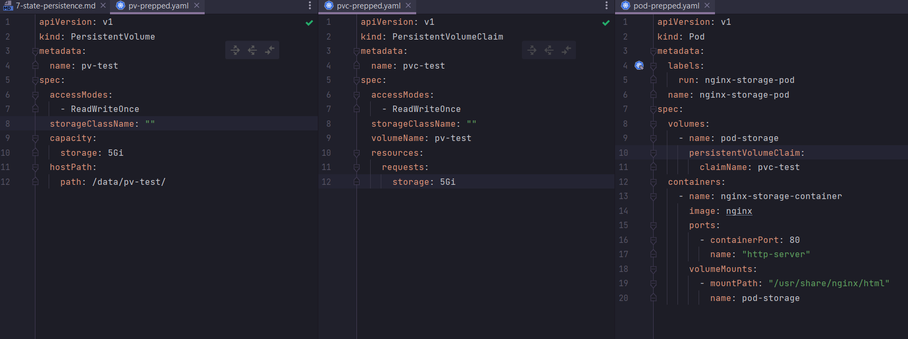
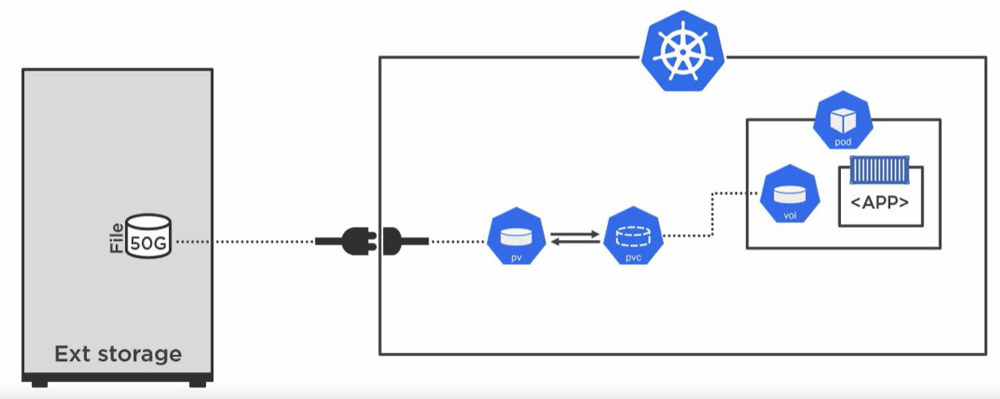
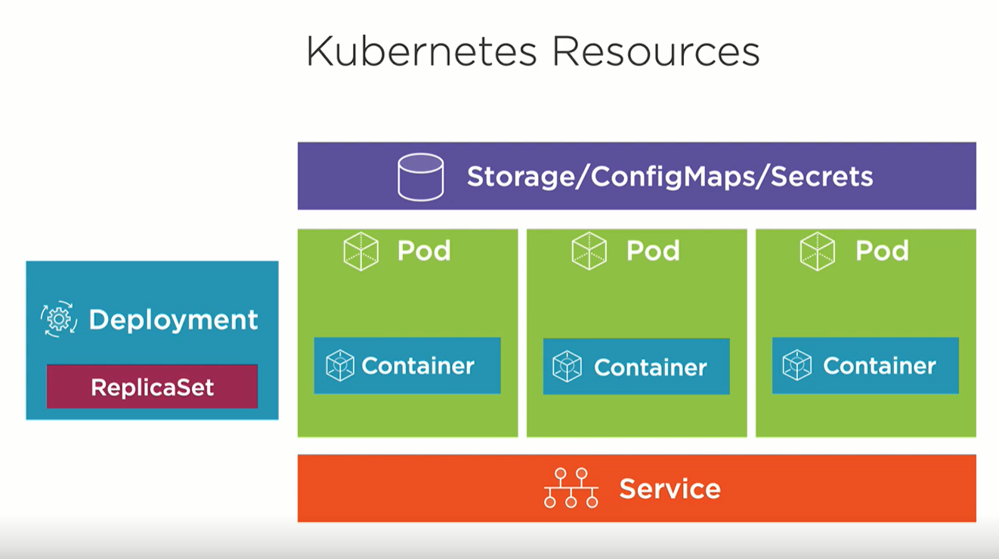

_---
marp: true
theme: default
style: |
img[alt~="center"] {
display: block;
margin: 0 auto;
}
---

# 8. Configuration

```
 _  __     _                          _            
| |/ /   _| |__   ___ _ __ _ __   ___| |_ ___  ___ 
| ' / | | | '_ \ / _ \ '__| '_ \ / _ \ __/ _ \/ __|
| . \ |_| | |_) |  __/ |  | | | |  __/ ||  __/\__ \
|_|\_\__,_|_.__/ \___|_|  |_| |_|\___|\__\___||___/


```

##### presenterad av Dominic Chan, dominic.chan@knowit.se

---

# SSH till er AWS instans

`ssh -i ~/.ssh/aws-linux-demo.pem ubuntu@ubuntu@ec2-16-171-26-141.eu-north-1.compute.amazonaws.com`

---

# Installera Minikube

1. `cd docker-k8s-kurs-och-cert`
2. `cd 8-configuration`
3. `cat minikube.sh`
4. `sudo chmod +x minikube.sh`
5. `./minikube.sh`
6. Kör kommandot `source /home/ubuntu/.bashrc`

---



---



---

# Konfigurera dynamisk volym med Storage class

- https://minikube.sigs.k8s.io/docs/tutorials/volume_snapshots_and_csi/
- `minikube addons enable volumesnapshots`
- `minikube addons enable csi-hostpath-driver`
- `kubectl get storageclass`
- pvc-storage-class-prepped.yaml
- `kubectl apply -f pvc-storage-class-prepped.yaml`
- `kubectl get pvc`
- `kubectl get pv`

---

# Configuration

- ConfigMaps
- Secrets
  

---

# ConfigMaps

- ConfigMaps används för att frikoppla konfiguration från containerimage och applikation
- Används för att specificera konfigurationsparametrar som läses in av container/applikation
- Får max vara 1 Mb stor
- ConfigMaps kan skapas imperativt eller deklarativt

---

# ConfigMaps - imperativt

- `kubectl create configmap <configmap-namn> <källa-till-configmap>`
- `kubectl create configmap test-configmap-dir --from-file=./configmap/`
- `kubectl create configmap test-configmap-files --from-file=./configmap/game.properties --from-file=./configmap/ui.properties`
- `kubectl create configmap test-configmap-file --from-file=./configmap/game.properties`
- `kubectl create configmap test-configmap-env-file --from-env-file=./configmap/game-env-file.properties`
- `kubectl create configmap test-configmap-env-files --from-env-file=./configmap/game-env-file.properties --from-env-file=./configmap/ui-env-file.properties`
- `kubectl create configmap test-configmap-literal --from-literal=zone=prod`

---

# Secrets

- Secrets är lik ConfigMaps, men används specifikt för känslig eller konfidentiell data
- Datat är Base64 enkodat, men är inte krypterad
- Får max vara 1 Mb stor
- Det är rekommenderat att använda externa secret store, begränsa åtkomst till secrets och kryptera lagringen av datat
- Secret kan skapas imperativt eller deklarativt

---

# Secrets - imperativt

- `kubectl create secret <typ-av-secret> <secret-namn> <källa-till-secret>`
- `kubectl create secret generic test-secret-from-file --from-file=./configmap/game.properties`
- `kubectl create secret generic test-secret-from-env-file --from-file=./configmap/game-env-file.properties`
- `kubectl create secret generic test-secret-from-literal --from-literal=app=testapp`

---

# Security context

1. `kubectl apply -f pod-busybox-prepped.yaml`
2. `kubectl exec -it busybox -- /bin/sh`
3. `id`

1. `kubectl apply -f pod-busybox-security-context-prepped.yaml`
2. `kubectl exec -it secbusybox -- /bin/sh`
3. `id`

---

# Använd ConfigMap eller Secret i en Pod

- https://kubernetes.io/docs/tasks/configure-pod-container/configure-pod-configmap/
- Ladda in ConfigMap data som miljövariabel
- Montera ConfigMap data som läsbar volym

---

# Använd ConfigMap eller Secret data som miljövariabel

- https://kubernetes.io/docs/tasks/configure-pod-container/configure-pod-configmap/#define-a-container-environment-variable-with-data-from-a-single-configmap
- `kubectl apply -f pod-busybox-single-configmap-env-variable.yaml`
- https://kubernetes.io/docs/tasks/configure-pod-container/configure-pod-configmap/#configure-all-key-value-pairs-in-a-configmap-as-container-environment-variables
- `kubectl apply -f pod-busybox-all-configmap-env-variable.yaml`

---

# Använd ConfigMap eller Secret data som läsbar volym

- https://kubernetes.io/docs/tasks/configure-pod-container/configure-pod-configmap/#add-configmap-data-to-a-volume
- `kubectl apply -f pod-busybox-configmap-as-volume-prepped.yaml`

---

# Resources

- https://kubernetes.io/docs/tasks/configure-pod-container/assign-cpu-resource/
- `minikube addons enable metrics-server`
- `kubectl apply -f pod-cpu-demo-resources.yaml`

---

# Övningar

- https://medium.com/bb-tutorials-and-thoughts/practice-enough-with-these-questions-for-the-ckad-exam-2f42d1228552 från
  övningarna 105 - 131

---_